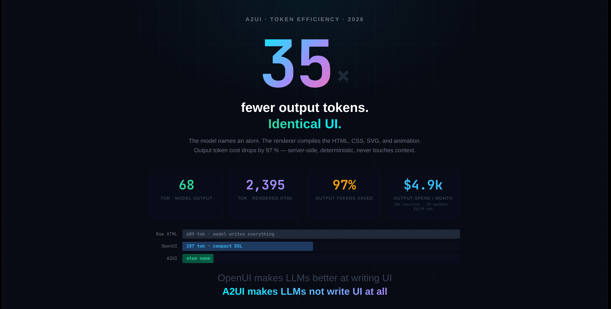

<div align="center">



# A2UI Catalogue

**A component vocabulary for agent-driven interfaces.**  
The model names an atom. The renderer compiles the HTML, CSS, SVG, and animation.

[](atoms/)
[](apps-script-surface/)
[](spec/)
[](LICENSE)
[](spec/)

</div>

---

## The idea

Rather than asking an agent to generate custom UI every turn — expensive, fragile, unpredictable — give it a stable vocabulary of atoms and let it compose from those.

```
Raw HTML   609 tok  ████████████████████████████████████████
OpenUI     287 tok  ███████████████████
A2UI        68 tok  ████
```

**35× fewer output tokens. Identical UI.** The renderer expands a 68-token atom reference into 2,395 tokens of compiled HTML server-side — it never re-enters the model's context window.

---

## Google Apps Script renderer — try it live

**295 atoms running natively in Google Apps Script.** No CDN, no dependencies, no server. Paste a JSON block list, get a rendered page.

```json
{
  "title": "Hello A2UI",
  "theme": "light",
  "blocks": [
    { "component": "heading", "level": 1, "text": "My first A2UI page" },
    { "component": "callout", "icon": "💡", "text": "Built with **295 atoms** in Google Apps Script." },
    { "component": "chartjs_bar", "title": "Quick chart", "bar_color": "#6366f1",
      "data": [{ "label": "A", "value": 80 }, { "label": "B", "value": 45 }, { "label": "C", "value": 62 }] }
  ]
}
```

### What's in the GAS renderer

| Feature | Detail |
|---|---|
| **295 registered atoms** | Full parity with `renderers/web_article.py` |
| **CSS-only interactions** | Tabs, carousel, gallery lightbox, modals, accordions — zero JS required |
| **Inline SVG charts** | Bar, line, pie, donut, heatmap, punch card, sankey, cohort retention, GitHub activity grid |
| **8 form input types** | text, email, select, radio, checkbox, switch, slider, date — native HTML controls |
| **Animation fallbacks** | 32 motion atoms degrade to readable content cards |
| **No CDN** | Works inside GAS sandboxed iframes with no external requests |
| **Large payload support** | Automatically switches to POST for schemas too large for a URL |

Copy [`apps-script-surface/a2ui-gem-renderer/atom.gs`](apps-script-surface/a2ui-gem-renderer/atom.gs) and [`atoms_charts.gs`](apps-script-surface/a2ui-gem-renderer/atoms_charts.gs) into any GAS project and call `renderAtoms(blocks, { theme: 'light' })`.

---

## What's in this repo

| Directory | Contents |
|---|---|
| `atoms/` | Atom schema definitions (435 atoms, `schema.yaml`) |
| `renderers/` | Surface renderers — `web_article.py` is the canonical web renderer |
| `apps-script-surface/` | **GAS renderer** — `atom.gs` + `atoms_charts.gs` (295 atoms, no CDN) |
| `components/` | Lit Web Components for the meet-stage surface |
| `scripts/` | Publishing pipeline to Firestore |
| `vendors/` | Landscape analysis of 9 UI libraries mapped to A2UI atoms |
| `benchmarks/` | OpenUI comparison benchmark — token counts across 7 scenarios |
| `spec/` | A2UI v0.9 draft spec and gdm-v0.2 component contract |
| `examples/` | Playbook YAML examples |
| `knowledge-catalogue/` | Curriculum-to-atom pipeline — converts structured knowledge into A2UI blocks. Separate concern from the atom vocabulary itself; see `knowledge-catalogue/README.md`. |

---

## 435 atoms across 5 surfaces

Atoms declare which surfaces they support at the schema level. An agent picks an atom by name, supplies parameters, and the renderer handles the rest.

```json
[{
  "type": "stat_card",
  "label": "Output tokens saved",
  "value": "97%",
  "delta": "+35×"
}]
```

Agents **never** write HTML. They compose from the vocabulary.

---

## Surface compatibility

| Symbol | Meaning |
|---|---|
| ✅ | Full support |
| ⚠️ | Renders with caveats |
| ❌ | Incompatible — do not use |
| — | Not applicable |

<details>
<summary><strong>View full compatibility matrix (435 atoms)</strong></summary>

| Atom | web | meet-stage | googlechat | email | pdf | Source |
|---|---|---|---|---|---|---|
| `intro` | ✅ | ✅ | ✅ | ✅ | ✅ | [a2ui-catalogue](https://github.com/curtiskrygier/a2ui-catalogue) |
| `body` | ✅ | ✅ | ✅ | ✅ | ✅ | [a2ui-catalogue](https://github.com/curtiskrygier/a2ui-catalogue) |
| `heading` | ✅ | ✅ | ✅ | ✅ | ✅ | [a2ui-catalogue](https://github.com/curtiskrygier/a2ui-catalogue) |
| `subheading` | ✅ | ✅ | ✅ | ✅ | ✅ | [a2ui-catalogue](https://github.com/curtiskrygier/a2ui-catalogue) |
| `quote` | ✅ | ✅ | ⚠️ | ✅ | ✅ | [a2ui-catalogue](https://github.com/curtiskrygier/a2ui-catalogue) |
| `code` | ✅ | ✅ | ⚠️ | ⚠️ | ✅ | [a2ui-catalogue](https://github.com/curtiskrygier/a2ui-catalogue) |
| `pipeline` | ✅ | ✅ | ⚠️ | ⚠️ | ✅ | [a2ui-catalogue](https://github.com/curtiskrygier/a2ui-catalogue) |
| `bullet_list` | ✅ | ✅ | ✅ | ✅ | ✅ | [a2ui-catalogue](https://github.com/curtiskrygier/a2ui-catalogue) |
| `divider` | ✅ | ✅ | ⚠️ | ✅ | ✅ | [a2ui-catalogue](https://github.com/curtiskrygier/a2ui-catalogue) |
| `youtube` | ✅ | ✅ | ❌ | ❌ | ❌ | [a2ui-catalogue](https://github.com/curtiskrygier/a2ui-catalogue) |
| `image` | ✅ | ✅ | ⚠️ | ✅ | ✅ | [a2ui-catalogue](https://github.com/curtiskrygier/a2ui-catalogue) |
| `image_pair` | ✅ | ✅ | ⚠️ | ⚠️ | ✅ | [a2ui-catalogue](https://github.com/curtiskrygier/a2ui-catalogue) |
| `diagram` | ✅ | ✅ | ⚠️ | ⚠️ | ✅ | [a2ui-catalogue](https://github.com/curtiskrygier/a2ui-catalogue) |
| `github_repo_card` | ✅ | ⚠️ | ⚠️ | ⚠️ | ⚠️ | [a2ui-catalogue](https://github.com/curtiskrygier/a2ui-catalogue) |
| `repo_links` | ✅ | ✅ | ⚠️ | ✅ | ✅ | [a2ui-catalogue](https://github.com/curtiskrygier/a2ui-catalogue) |
| `closing` | ✅ | ✅ | ✅ | ✅ | ✅ | [a2ui-catalogue](https://github.com/curtiskrygier/a2ui-catalogue) |
| `callout` | ✅ | ✅ | ⚠️ | ⚠️ | ✅ | [a2ui-catalogue](https://github.com/curtiskrygier/a2ui-catalogue) |
| `steps` | ✅ | ✅ | ⚠️ | ⚠️ | ✅ | [a2ui-catalogue](https://github.com/curtiskrygier/a2ui-catalogue) |
| `table` | ✅ | ✅ | ⚠️ | ✅ | ✅ | [a2ui-catalogue](https://github.com/curtiskrygier/a2ui-catalogue) |
| `tabs` | ✅ | ✅ | ❌ | ❌ | ❌ | [a2ui-catalogue](https://github.com/curtiskrygier/a2ui-catalogue) |
| `key_value` | ✅ | ✅ | ⚠️ | ⚠️ | ✅ | [a2ui-catalogue](https://github.com/curtiskrygier/a2ui-catalogue) |
| `before_after` | ✅ | ✅ | ❌ | ❌ | ⚠️ | [a2ui-catalogue](https://github.com/curtiskrygier/a2ui-catalogue) |
| `api_reference` | ✅ | ✅ | ⚠️ | ⚠️ | ✅ | [a2ui-catalogue](https://github.com/curtiskrygier/a2ui-catalogue) |
| `gallery` | ✅ | ⚠️ | ❌ | ❌ | ⚠️ | [a2ui-catalogue](https://github.com/curtiskrygier/a2ui-catalogue) |
| `video_pair` | ✅ | ✅ | ❌ | ❌ | ❌ | [a2ui-catalogue](https://github.com/curtiskrygier/a2ui-catalogue) |
| `carousel` | ✅ | ✅ | ❌ | ❌ | ⚠️ | [a2ui-catalogue](https://github.com/curtiskrygier/a2ui-catalogue) |
| `timeline` | ✅ | ✅ | ⚠️ | ⚠️ | ✅ | [a2ui-catalogue](https://github.com/curtiskrygier/a2ui-catalogue) |
| `annotated_code` | ✅ | ✅ | ❌ | ❌ | ⚠️ | [a2ui-catalogue](https://github.com/curtiskrygier/a2ui-catalogue) |
| `stat_card` | ✅ | ✅ | ❌ | ❌ | ⚠️ | [UIverse.io community](https://uiverse.io) |
| `progress_bar` | ✅ | ✅ | ❌ | ❌ | ⚠️ | [UIverse.io community](https://uiverse.io) |
| `badge_group` | ✅ | ✅ | ❌ | ⚠️ | ⚠️ | [UIverse.io community](https://uiverse.io) |
| `sparkline` | ✅ | ✅ | ❌ | ❌ | ❌ | [UIverse.io community](https://uiverse.io) |
| `heatmap` | ✅ | ✅ | ❌ | ❌ | ❌ | [UIverse.io community](https://uiverse.io) |
| `punch_card` | ✅ | ✅ | ❌ | ❌ | ❌ | [a2ui-catalogue](https://github.com/curtiskrygier/a2ui-catalogue) |
| `sankey_flow` | ✅ | ✅ | ❌ | ❌ | ❌ | [a2ui-catalogue](https://github.com/curtiskrygier/a2ui-catalogue) |
| `cohort_retention` | ✅ | ✅ | ❌ | ❌ | ❌ | [a2ui-catalogue](https://github.com/curtiskrygier/a2ui-catalogue) |
| `donut_stat` | ✅ | ✅ | ⚠️ | ❌ | ❌ | [UIverse.io community](https://uiverse.io) |
| `metric_delta` | ✅ | ✅ | ✅ | ✅ | ✅ | [a2ui-catalogue](https://github.com/curtiskrygier/a2ui) |
| `task_list` | ✅ | ✅ | ❌ | ❌ | ❌ | [a2ui-catalogue](https://github.com/curtiskrygier/a2ui-catalogue) |
| `sentiment_summary` | ✅ | ✅ | ❌ | ❌ | ❌ | [a2ui-catalogue](https://github.com/curtiskrygier/a2ui-catalogue) |
| `trend_indicator` | ✅ | ✅ | ✅ | ✅ | ✅ | [a2ui-catalogue](https://github.com/curtiskrygier/a2ui) |
| `breadcrumb` | ✅ | ✅ | ⚠️ | ⚠️ | ⚠️ | [a2ui-catalogue](https://github.com/curtiskrygier/a2ui) |
| `pagination` | ✅ | ✅ | ⚠️ | ⚠️ | ⚠️ | [a2ui-catalogue](https://github.com/curtiskrygier/a2ui) |
| `stepper` | ✅ | ✅ | ⚠️ | ⚠️ | ⚠️ | [a2ui-catalogue](https://github.com/curtiskrygier/a2ui) |
| `tab_bar` | ✅ | ✅ | ⚠️ | ⚠️ | ⚠️ | [a2ui-catalogue](https://github.com/curtiskrygier/a2ui) |
| `anchor_list` | ✅ | ✅ | ⚠️ | ✅ | ✅ | [a2ui-catalogue](https://github.com/curtiskrygier/a2ui) |
| `faq_accordion` | ✅ | ✅ | ⚠️ | ⚠️ | ✅ | [a2ui-catalogue](https://github.com/curtiskrygier/a2ui) |
| `glossary_term` | ✅ | ✅ | ✅ | ✅ | ✅ | [a2ui-catalogue](https://github.com/curtiskrygier/a2ui) |
| `footnote` | ✅ | ✅ | ✅ | ✅ | ✅ | [a2ui-catalogue](https://github.com/curtiskrygier/a2ui) |
| `blockquote_with_avatar` | ✅ | ✅ | ⚠️ | ⚠️ | ✅ | [a2ui-catalogue](https://github.com/curtiskrygier/a2ui) |
| `pull_stat` | ✅ | ✅ | ✅ | ✅ | ✅ | [a2ui-catalogue](https://github.com/curtiskrygier/a2ui) |
| `accordion_item` | ✅ | ✅ | ❌ | ❌ | ❌ | [a2ui-catalogue](https://github.com/curtiskrygier/a2ui) |
| `tooltip` | ✅ | ✅ | ❌ | ❌ | ❌ | [a2ui-catalogue](https://github.com/curtiskrygier/a2ui) |
| `hover_card` | ✅ | ✅ | ❌ | ❌ | ❌ | [a2ui-catalogue](https://github.com/curtiskrygier/a2ui) |
| `collapsible_panel` | ✅ | ✅ | ❌ | ❌ | ❌ | [a2ui-catalogue](https://github.com/curtiskrygier/a2ui) |
| `css_modal` | ✅ | ✅ | ❌ | ❌ | ❌ | [UIverse.io community](https://uiverse.io) |
| `audio_player` | ✅ | ✅ | ⚠️ | ⚠️ | — | [a2ui-catalogue](https://github.com/curtiskrygier/a2ui) |
| `audio_link` | ✅ | ✅ | ✅ | ✅ | ✅ | [a2ui-catalogue](https://github.com/curtiskrygier/a2ui) |
| `pdf_preview` | ✅ | ✅ | ⚠️ | ⚠️ | — | [a2ui-catalogue](https://github.com/curtiskrygier/a2ui) |
| `document_link` | ✅ | ✅ | ✅ | ✅ | ✅ | [a2ui-catalogue](https://github.com/curtiskrygier/a2ui) |
| `video_thumbnail` | ✅ | ✅ | ⚠️ | ⚠️ | — | [a2ui-catalogue](https://github.com/curtiskrygier/a2ui) |
| `video_card` | ✅ | ✅ | ⚠️ | ⚠️ | — | [a2ui-catalogue](https://github.com/curtiskrygier/a2ui) |
| `code_diff` | ✅ | ✅ | ⚠️ | ❌ | ⚠️ | [a2ui-catalogue](https://github.com/curtiskrygier/a2ui) |
| `code_snippet_pair` | ✅ | ✅ | ⚠️ | ⚠️ | — | [a2ui-catalogue](https://github.com/curtiskrygier/a2ui) |
| `framed_screenshot` | ✅ | ✅ | ❌ | ❌ | ❌ | [a2ui-catalogue](https://github.com/curtiskrygier/a2ui) |
| `image_with_caption` | ✅ | ✅ | ✅ | ✅ | ✅ | [a2ui-catalogue](https://github.com/curtiskrygier/a2ui) |
| `alert_banner` | ✅ | ✅ | ⚠️ | ❌ | — | [UIverse.io community](https://uiverse.io) |
| `toast_notification` | ✅ | ✅ | ❌ | ❌ | — | [UIverse.io community](https://uiverse.io) |
| `loading_skeleton` | ✅ | ✅ | ❌ | ❌ | — | [UIverse.io community](https://uiverse.io) |
| `empty_state` | ✅ | ✅ | ⚠️ | ⚠️ | — | [a2ui-catalogue](https://github.com/curtiskrygier/a2ui) |
| `spinner` | ✅ | ✅ | ❌ | ❌ | — | [UIverse.io community](https://uiverse.io) |
| `status_pill` | ✅ | ✅ | ⚠️ | ⚠️ | — | [UIverse.io community](https://uiverse.io) |
| `inline_feedback_message` | ✅ | ✅ | ⚠️ | ⚠️ | — | [a2ui-catalogue](https://github.com/curtiskrygier/a2ui) |
| `rating_stars` | ✅ | ✅ | ⚠️ | ⚠️ | — | [UIverse.io community](https://uiverse.io) |
| `progress_circle` | ✅ | ✅ | ❌ | ❌ | ⚠️ | [UIverse.io community](https://uiverse.io) |
| `action_required_card` | ✅ | ✅ | ✅ | ⚠️ | — | [a2ui-catalogue](https://github.com/curtiskrygier/a2ui) |
| `feature_matrix` | ✅ | ✅ | ⚠️ | ❌ | ✅ | [a2ui-catalogue](https://github.com/curtiskrygier/a2ui/catalogue) |
| `pricing_tier_card` | ✅ | ✅ | ✅ | ✅ | ✅ | [a2ui-catalogue](https://github.com/curtiskrygier/a2ui/catalogue) |
| `pricing_tier_group` | ✅ | ✅ | ⚠️ | ⚠️ | ✅ | [a2ui-catalogue](https://github.com/curtiskrygier/a2ui/catalogue) |
| `pros_cons_list` | ✅ | ✅ | ✅ | ✅ | ✅ | [a2ui-catalogue](https://github.com/curtiskrygier/a2ui/catalogue) |
| `side_by_side_spec` | ✅ | ✅ | ⚠️ | ❌ | ✅ | [a2ui-catalogue](https://github.com/curtiskrygier/a2ui/catalogue) |
| `product_spec_table` | ✅ | ✅ | ⚠️ | ❌ | ✅ | [a2ui-catalogue](https://github.com/curtiskrygier/a2ui/catalogue) |
| `comparison_grid` | ✅ | ✅ | ⚠️ | ⚠️ | ✅ | [a2ui-catalogue](https://github.com/curtiskrygier/a2ui/catalogue) |
| `versus_block` | ✅ | ✅ | ⚠️ | ⚠️ | — | [a2ui-catalogue](https://github.com/curtiskrygier/a2ui/catalogue) |
| `rating_comparison` | ✅ | ✅ | ✅ | ✅ | ✅ | [a2ui-catalogue](https://github.com/curtiskrygier/a2ui/catalogue) |
| `capability_checklist` | ✅ | ✅ | ⚠️ | ❌ | ✅ | [a2ui-catalogue](https://github.com/curtiskrygier/a2ui/catalogue) |
| `toggle_switch` | ✅ | ✅ | ❌ | ❌ | ❌ | [UIverse.io community](https://uiverse.io) |
| `expandable_text` | ✅ | ✅ | ❌ | ❌ | ❌ | [a2ui-catalogue](https://github.com/curtiskrygier/a2ui) |
| `flip_card` | ✅ | ✅ | ❌ | ❌ | ❌ | [UIverse.io community](https://uiverse.io) |
| `image_hotspots` | ✅ | ✅ | ❌ | ❌ | ❌ | [UIverse.io community](https://uiverse.io) |
| `css_dropdown_menu` | ✅ | ✅ | ❌ | ❌ | ❌ | [UIverse.io community](https://uiverse.io) |
| `star_rating_input` | ✅ | ✅ | ❌ | ❌ | ❌ | [UIverse.io community](https://uiverse.io) |
| `segmented_control` | ✅ | ✅ | ❌ | ❌ | ❌ | [UIverse.io community](https://uiverse.io) |
| `zoomable_image` | ✅ | ✅ | ❌ | ❌ | ❌ | [UIverse.io community](https://uiverse.io) |
| `custom_checkbox_group` | ✅ | ✅ | ❌ | ❌ | ❌ | [UIverse.io community](https://uiverse.io) |
| `css_slide_panel` | ✅ | ✅ | ❌ | ❌ | ❌ | [UIverse.io community](https://uiverse.io) |
| `testimonial_card` | ✅ | ✅ | ⚠️ | ⚠️ | ✅ | [a2ui-catalogue](https://github.com/curtiskrygier/a2ui) |
| `star_rating_display` | ✅ | ✅ | ⚠️ | ⚠️ | ✅ | [UIverse.io community](https://uiverse.io) |
| `avatar_group` | ✅ | ✅ | ⚠️ | ⚠️ | ✅ | [UIverse.io community](https://uiverse.io) |
| `contributor_list` | ✅ | ✅ | ⚠️ | ⚠️ | ✅ | [a2ui-catalogue](https://github.com/curtiskrygier/a2ui) |
| `customer_logo_grid` | ✅ | ✅ | ⚠️ | ⚠️ | ✅ | [a2ui-catalogue](https://github.com/curtiskrygier/a2ui) |
| `social_proof_banner` | ✅ | ✅ | ⚠️ | ⚠️ | ✅ | [UIverse.io community](https://uiverse.io) |
| `media_mention_card` | ✅ | ✅ | ⚠️ | ⚠️ | ✅ | [a2ui-catalogue](https://github.com/curtiskrygier/a2ui) |
| `expert_endorsement` | ✅ | ✅ | ⚠️ | ⚠️ | ✅ | [a2ui-catalogue](https://github.com/curtiskrygier/a2ui) |
| `review_callout` | ✅ | ✅ | ⚠️ | ⚠️ | ✅ | [a2ui-catalogue](https://github.com/curtiskrygier/a2ui) |
| `social_feed_embed` | ✅ | ✅ | ❌ | ❌ | ❌ | [a2ui-catalogue](https://github.com/curtiskrygier/a2ui) |
| `terminal_block` | ✅ | ⚠️ | ⚠️ | ⚠️ | — | [a2ui-catalogue](https://github.com/curtiskrygier/a2ui-catalogue) |
| `file_tree` | ✅ | ⚠️ | ⚠️ | ⚠️ | — | [ui](https://github.com/curtiskrygier/a2ui-catalogue) |
| `tabbed_code` | ✅ | ⚠️ | ⚠️ | ⚠️ | — | [ui](https://github.com/curtiskrygier/a2ui-catalogue) |
| `http_request_block` | ✅ | ⚠️ | ⚠️ | ⚠️ | — | [Flowbite](https://github.com/curtiskrygier/a2ui-catalogue) |
| `env_var_list` | ✅ | ⚠️ | ⚠️ | ⚠️ | — | [a2ui-catalogue](https://github.com/curtiskrygier/a2ui-catalogue) |
| `prerequisite_checklist` | ✅ | — | ⚠️ | ⚠️ | — | [Flowbite](https://github.com/curtiskrygier/a2ui-catalogue) |
| `keyboard_shortcut` | ✅ | — | ⚠️ | ⚠️ | — | [Flowbite](https://github.com/curtiskrygier/a2ui-catalogue) |
| `api_param_table` | ✅ | ⚠️ | ⚠️ | ⚠️ | — | [ui](https://github.com/curtiskrygier/a2ui-catalogue) |
| `version_badge` | ✅ | — | ⚠️ | ⚠️ | — | [Flowbite](https://github.com/curtiskrygier/a2ui-catalogue) |
| `deprecation_notice` | ✅ | — | ⚠️ | ⚠️ | — | [ui](https://github.com/curtiskrygier/a2ui-catalogue) |
| `experimental_banner` | ✅ | — | ⚠️ | ⚠️ | — | [Flowbite](https://github.com/curtiskrygier/a2ui-catalogue) |
| `cli_command` | ✅ | ⚠️ | ⚠️ | ⚠️ | — | [UIverse.io community](https://uiverse.io/) |
| `copy_code_button` | ✅ | ⚠️ | ⚠️ | ⚠️ | — | [UIverse.io community](https://uiverse.io/) |
| `log_output` | ✅ | ⚠️ | ⚠️ | ⚠️ | — | [a2ui-catalogue](https://github.com/curtiskrygier/a2ui-catalogue) |
| `json_tree_viewer` | ✅ | ⚠️ | ⚠️ | ⚠️ | — | [ui](https://github.com/curtiskrygier/a2ui-catalogue) |
| `key_takeaways` | ✅ | — | ⚠️ | ⚠️ | — | [Flowbite](https://github.com/curtiskrygier/a2ui-catalogue) |
| `summary_box` | ✅ | — | ⚠️ | ⚠️ | — | [ui](https://github.com/curtiskrygier/a2ui-catalogue) |
| `learning_objectives` | ✅ | — | ⚠️ | ⚠️ | — | [Flowbite](https://github.com/curtiskrygier/a2ui-catalogue) |
| `changelog_entry` | ✅ | ⚠️ | ⚠️ | ⚠️ | — | [ui](https://github.com/curtiskrygier/a2ui-catalogue) |
| `release_notes` | ✅ | — | ⚠️ | ⚠️ | — | [Flowbite](https://github.com/curtiskrygier/a2ui-catalogue) |
| `further_reading` | ✅ | — | ⚠️ | ⚠️ | — | [a2ui-catalogue](https://github.com/curtiskrygier/a2ui-catalogue) |
| `resources_list` | ✅ | — | ⚠️ | ⚠️ | — | [Flowbite](https://github.com/curtiskrygier/a2ui-catalogue) |
| `sidebar_note` | ✅ | ⚠️ | ⚠️ | ⚠️ | — | [ui](https://github.com/curtiskrygier/a2ui-catalogue) |
| `difficulty_badge` | ✅ | — | ⚠️ | ⚠️ | — | [Flowbite](https://github.com/curtiskrygier/a2ui-catalogue) |
| `caution_block` | ✅ | — | ⚠️ | ⚠️ | — | [ui](https://github.com/curtiskrygier/a2ui-catalogue) |
| `checklist_interactive` | ✅ | ⚠️ | ⚠️ | ⚠️ | — | [Flowbite](https://github.com/curtiskrygier/a2ui-catalogue) |
| `glossary_inline` | ✅ | ⚠️ | ⚠️ | ⚠️ | — | [ui](https://github.com/curtiskrygier/a2ui-catalogue) |
| `time_estimate` | ✅ | — | ⚠️ | ⚠️ | — | [Flowbite](https://github.com/curtiskrygier/a2ui-catalogue) |
| `progress_checkpoint` | ✅ | ⚠️ | ⚠️ | ⚠️ | — | [ui](https://github.com/curtiskrygier/a2ui-catalogue) |
| `social_share_bar` | ✅ | ⚠️ | ⚠️ | ⚠️ | — | [UIverse.io community](https://uiverse.io/) |
| `newsletter_cta` | ✅ | ⚠️ | ⚠️ | ⚠️ | — | [Flowbite](https://github.com/curtiskrygier/a2ui-catalogue) |
| `author_bio_card` | ✅ | — | ⚠️ | ⚠️ | — | [Flowbite](https://github.com/curtiskrygier/a2ui-catalogue) |
| `related_posts_grid` | ✅ | ⚠️ | ⚠️ | ⚠️ | — | [a2ui-catalogue](https://github.com/curtiskrygier/a2ui-catalogue) |
| `series_overview_card` | ✅ | — | ⚠️ | ⚠️ | — | [ui](https://github.com/curtiskrygier/a2ui-catalogue) |
| `reaction_group` | ✅ | ⚠️ | ⚠️ | ⚠️ | — | [UIverse.io community](https://uiverse.io/) |
| `share_quote` | ✅ | ⚠️ | ⚠️ | ⚠️ | — | [Flowbite](https://github.com/curtiskrygier/a2ui-catalogue) |
| `follow_cta` | ✅ | — | ⚠️ | ⚠️ | — | [Flowbite](https://github.com/curtiskrygier/a2ui-catalogue) |
| `follow_button` | ✅ | ⚠️ | ⚠️ | ⚠️ | — | [UIverse.io community](https://uiverse.io/) |
| `reading_progress_bar` | ✅ | ⚠️ | ⚠️ | ⚠️ | — | [a2ui-catalogue](https://github.com/curtiskrygier/a2ui-catalogue) |
| `table_of_contents` | ✅ | ⚠️ | ⚠️ | ⚠️ | — | [a2ui-catalogue](https://github.com/curtiskrygier/a2ui-catalogue) |
| `article_hero` | ✅ | — | ⚠️ | ⚠️ | — | [a2ui-catalogue](https://github.com/curtiskrygier/a2ui-catalogue) |
| `scroll_to_top` | ✅ | ⚠️ | ⚠️ | ⚠️ | — | [a2ui-catalogue](https://github.com/curtiskrygier/a2ui-catalogue) |
| `article_series_nav` | ✅ | — | ⚠️ | ⚠️ | — | [a2ui-catalogue](https://github.com/curtiskrygier/a2ui-catalogue) |
| `embed_codepen` | ✅ | ⚠️ | ⚠️ | ⚠️ | — | [a2ui-catalogue](https://github.com/curtiskrygier/a2ui-catalogue) |
| `embed_stackblitz` | ✅ | ⚠️ | ⚠️ | ⚠️ | — | [a2ui-catalogue](https://github.com/curtiskrygier/a2ui-catalogue) |
| `embed_gist` | ✅ | — | ⚠️ | ⚠️ | — | [a2ui-catalogue](https://github.com/curtiskrygier/a2ui-catalogue) |
| `embed_tweet` | ✅ | ⚠️ | ⚠️ | ⚠️ | — | [a2ui-catalogue](https://github.com/curtiskrygier/a2ui-catalogue) |
| `embed_google_slides` | ✅ | ⚠️ | ⚠️ | ⚠️ | — | [a2ui-catalogue](https://github.com/curtiskrygier/a2ui-catalogue) |
| `lottie_animation` | ✅ | ⚠️ | ⚠️ | ⚠️ | — | [a2ui-catalogue](https://github.com/curtiskrygier/a2ui-catalogue) |
| `figma_embed` | ✅ | ⚠️ | ⚠️ | ⚠️ | — | [a2ui-catalogue](https://github.com/curtiskrygier/a2ui-catalogue) |
| `color_swatch_grid` | ✅ | ✅ | — | ⚠️ | — | [a2ui-catalogue](https://github.com/curtiskrygier/a2ui-catalogue) |
| `live_demo_embed` | ✅ | ⚠️ | ⚠️ | ⚠️ | — | [a2ui-catalogue](https://github.com/curtiskrygier/a2ui-catalogue) |
| `benchmark_comparison` | ✅ | ✅ | — | ⚠️ | — | [a2ui-catalogue](https://github.com/curtiskrygier/a2ui-catalogue) |
| `chartjs_bar` | ✅ | ⚠️ | ⚠️ | ⚠️ | — | [a2ui-catalogue](https://github.com/curtiskrygier/a2ui-catalogue) |
| `chartjs_line` | ✅ | ⚠️ | ⚠️ | ⚠️ | — | [a2ui-catalogue](https://github.com/curtiskrygier/a2ui-catalogue) |
| `data_table_sortable` | ✅ | ⚠️ | — | ⚠️ | — | [a2ui-catalogue](https://github.com/curtiskrygier/a2ui-catalogue) |
| `metric_comparison_card` | ✅ | ✅ | — | ⚠️ | — | [a2ui-catalogue](https://github.com/curtiskrygier/a2ui-catalogue) |
| `mini_sparkline_set` | ✅ | ✅ | — | ⚠️ | — | [a2ui-catalogue](https://github.com/curtiskrygier/a2ui-catalogue) |
| `status_dashboard` | ✅ | ✅ | — | ⚠️ | — | [a2ui-catalogue](https://github.com/curtiskrygier/a2ui-catalogue) |
| `uptime_timeline` | ✅ | ✅ | — | ⚠️ | — | [a2ui-catalogue](https://github.com/curtiskrygier/a2ui-catalogue) |
| `command_palette` | ✅ | ⚠️ | ⚠️ | ⚠️ | — | [a2ui-catalogue](https://github.com/curtiskrygier/a2ui-catalogue) |
| `search_result_card` | ✅ | ✅ | — | ⚠️ | — | [a2ui-catalogue](https://github.com/curtiskrygier/a2ui-catalogue) |
| `post_metadata_bar` | ✅ | ⚠️ | — | ⚠️ | — | [a2ui-catalogue](https://github.com/curtiskrygier/a2ui-catalogue) |
| `footnote_group` | ✅ | ⚠️ | — | ✅ | — | [a2ui-catalogue](https://github.com/curtiskrygier/a2ui-catalogue) |
| `notification_badge` | ✅ | ⚠️ | — | ⚠️ | — | [a2ui-catalogue](https://github.com/curtiskrygier/a2ui-catalogue) |
| `expandable_list` | ✅ | ⚠️ | — | ⚠️ | — | [a2ui-catalogue](https://github.com/curtiskrygier/a2ui-catalogue) |
| `poll_block` | ✅ | ⚠️ | — | ⚠️ | — | [a2ui-catalogue](https://github.com/curtiskrygier/a2ui-catalogue) |
| `abbr_tooltip` | ✅ | ⚠️ | — | ⚠️ | — | [a2ui-catalogue](https://github.com/curtiskrygier/a2ui-catalogue) |
| `copy_to_clipboard` | ✅ | ⚠️ | — | ⚠️ | — | [a2ui-catalogue](https://github.com/curtiskrygier/a2ui-catalogue) |
| `conversion_funnel` | ✅ | ✅ | ❌ | — | — | [a2ui-catalogue](https://github.com/curtiskrygier/a2ui-catalogue) |
| `gauge_sla` | ✅ | ✅ | ❌ | — | — | [a2ui-catalogue](https://github.com/curtiskrygier/a2ui-catalogue) |
| `stacked_area` | ✅ | ✅ | ❌ | — | — | [a2ui-catalogue](https://github.com/curtiskrygier/a2ui-catalogue) |
| `scatter_trend` | ✅ | ✅ | ❌ | — | — | [a2ui-catalogue](https://github.com/curtiskrygier/a2ui-catalogue) |
| `call_mood_board` | ✅ | ✅ | ❌ | — | — | [a2ui-catalogue](https://github.com/curtiskrygier/a2ui-catalogue) |
| `github_activity_grid` | ✅ | ✅ | ❌ | — | — | [a2ui-catalogue](https://github.com/curtiskrygier/a2ui-catalogue) |
| `form` | ✅ | ⚠️ | ❌ | ❌ | ❌ | [ Thesys](https://github.com/thesysdev/openui) |
| `form_input` | ✅ | ⚠️ | ❌ | ❌ | ❌ | [ Thesys](https://github.com/thesysdev/openui) |
| `form_select` | ✅ | ⚠️ | ❌ | ❌ | ❌ | [ Thesys](https://github.com/thesysdev/openui) |
| `form_radio_group` | ✅ | ⚠️ | ❌ | ❌ | ❌ | [ Thesys](https://github.com/thesysdev/openui) |
| `form_checkbox_group` | ✅ | ⚠️ | ❌ | ❌ | ❌ | [ Thesys](https://github.com/thesysdev/openui) |
| `form_switch_group` | ✅ | ⚠️ | ❌ | ❌ | ❌ | [ Thesys](https://github.com/thesysdev/openui) |
| `form_slider` | ✅ | ⚠️ | ❌ | ❌ | ❌ | [ Thesys](https://github.com/thesysdev/openui) |
| `form_date_picker` | ✅ | ⚠️ | ❌ | ❌ | ❌ | [ Thesys](https://github.com/thesysdev/openui) |
| `modal` | ✅ | ✅ | ❌ | ❌ | ❌ | [ Thesys](https://github.com/thesysdev/openui) |
| `follow_up_chips` | ✅ | ⚠️ | ❌ | ❌ | ❌ | [ Thesys](https://github.com/thesysdev/openui) |
| `choicebox_group` | ✅ | ⚠️ | ❌ | ❌ | ❌ | [a2ui-catalogue](https://github.com/curtiskrygier/a2ui-catalogue) |
| `feedback_prompt` | ✅ | ⚠️ | ❌ | ❌ | ❌ | [a2ui-catalogue](https://github.com/curtiskrygier/a2ui-catalogue) |
| `entity_list` | ✅ | ✅ | ✅ | ✅ | ✅ | [a2ui-catalogue](https://github.com/curtiskrygier/a2ui-catalogue) |
| `prompt_template` | ✅ | ✅ | ⚠️ | ⚠️ | ✅ | [a2ui-catalogue](https://github.com/curtiskrygier/a2ui-catalogue) |
| `model_card` | ✅ | ✅ | ✅ | ✅ | ✅ | [a2ui-catalogue](https://github.com/curtiskrygier/a2ui-catalogue) |
| `conversation_snippet` | ✅ | ✅ | ✅ | ✅ | ✅ | [a2ui-catalogue](https://github.com/curtiskrygier/a2ui-catalogue) |
| `shortcut_legend` | ✅ | ✅ | ✅ | ✅ | ✅ | [a2ui-catalogue](https://github.com/curtiskrygier/a2ui-catalogue) |
| `rating_summary_bar` | ✅ | ✅ | ✅ | ✅ | ✅ | [a2ui-catalogue](https://github.com/curtiskrygier/a2ui-catalogue) |
| `roadmap_card` | ✅ | ✅ | ✅ | ✅ | ✅ | [a2ui-catalogue](https://github.com/curtiskrygier/a2ui-catalogue) |
| `notification_stack` | ✅ | ✅ | ✅ | ✅ | ✅ | [a2ui-catalogue](https://github.com/curtiskrygier/a2ui-catalogue) |
| `inline_alert` | ✅ | ✅ | ⚠️ | ⚠️ | ⚠️ | [a2ui-catalogue](https://github.com/curtiskrygier/a2ui-catalogue) |
| `tag_block` | ✅ | ✅ | ⚠️ | ✅ | ✅ | [ Thesys](https://github.com/thesysdev/openui) |
| `variant_selector` | ✅ | ✅ | ❌ | ❌ | ❌ | [ Thesys](https://github.com/thesysdev/openui) |
| `markdown_block` | ✅ | ✅ | ⚠️ | ✅ | ✅ | [ Thesys](https://github.com/thesysdev/openui) |
| `chartjs_pie` | ✅ | ✅ | ⚠️ | ❌ | ✅ | [ Thesys](https://github.com/thesysdev/openui) |
| `text_callout` | ✅ | ✅ | ✅ | ✅ | ✅ | [ Thesys](https://github.com/thesysdev/openui) |
| `source_citation` | ✅ | ✅ | ⚠️ | ✅ | ✅ | [a2ui-catalogue](https://github.com/curtiskrygier/a2ui-catalogue) |
| `llm_comparison_table` | ✅ | ✅ | ⚠️ | ⚠️ | ✅ | [a2ui-catalogue](https://github.com/curtiskrygier/a2ui-catalogue) |
| `confidence_bar` | ✅ | ✅ | ⚠️ | ✅ | ✅ | [a2ui-catalogue](https://github.com/curtiskrygier/a2ui-catalogue) |
| `token_budget_meter` | ✅ | ✅ | ⚠️ | ⚠️ | ✅ | [a2ui-catalogue](https://github.com/curtiskrygier/a2ui-catalogue) |
| `product_thumbnail` | ✅ | ✅ | ⚠️ | ✅ | ✅ | [Shopify Polaris](https://github.com/Shopify/polaris) |
| `order_status_card` | ✅ | ✅ | ⚠️ | ✅ | ✅ | [Shopify Polaris](https://github.com/Shopify/polaris) |
| `inventory_table` | ✅ | ✅ | ⚠️ | ✅ | ✅ | [Shopify Polaris](https://github.com/Shopify/polaris) |
| `jira_ticket` | ✅ | ✅ | ⚠️ | ✅ | ✅ | [Atlassian Design System](https://atlassian.design) |
| `sprint_board` | ✅ | ✅ | ⚠️ | ⚠️ | ✅ | [Atlassian Design System](https://atlassian.design) |
| `lozenge` | ✅ | ✅ | ⚠️ | ✅ | ✅ | [Atlassian Design System](https://atlassian.design) |
| `data_grid` | ✅ | ✅ | ⚠️ | ⚠️ | ✅ | [IBM Carbon Design System](https://github.com/carbon-design-system/carbon) |
| `tree_view` | ✅ | ✅ | ⚠️ | ✅ | ✅ | [IBM Carbon Design System](https://github.com/carbon-design-system/carbon) |
| `heatmap_calendar` | ✅ | ✅ | ⚠️ | ⚠️ | ✅ | [IBM Carbon Design System](https://github.com/carbon-design-system/carbon) |
| `combobox` | ✅ | ✅ | ❌ | ❌ | ⚠️ | [ui](https://github.com/shadcn-ui/ui) |
| `feature_grid` | ✅ | ⚠️ | ❌ | ⚠️ | ✅ | [ shadcn](https://tailwindui.com) |
| `navigation_menu` | ✅ | ❌ | ❌ | ❌ | ⚠️ | [ shadcn](https://www.radix-ui.com/primitives/docs/components/navigation-menu) |
| `multi_select_input` | ✅ | ✅ | ❌ | ❌ | ⚠️ | [ui](https://github.com/shadcn-ui/ui) |
| `otp_input` | ✅ | ⚠️ | ❌ | ❌ | ❌ | [ui](https://github.com/shadcn-ui/ui) |
| `bento_grid` | ✅ | ⚠️ | ❌ | ⚠️ | ✅ | [ shadcn](https://magicui.design) |
| `cta_section` | ✅ | ⚠️ | ⚠️ | ✅ | ✅ | [Tailwind UI](https://tailwindui.com) |
| `animated_counter` | ✅ | ⚠️ | ❌ | ❌ | ⚠️ | [a2ui-catalogue](https://github.com/curtiskrygier/a2ui/catalogue) |
| `media_stream_card` | ✅ | ✅ | ❌ | ⚠️ | ⚠️ | [a2ui-catalogue](https://github.com/curtiskrygier/a2ui/catalogue) |
| `live_aggregator` | ✅ | ✅ | ❌ | ⚠️ | ⚠️ | [a2ui-catalogue](https://github.com/curtiskrygier/a2ui/catalogue) |
| `vote_button_group` | ✅ | ✅ | ❌ | ⚠️ | ⚠️ | [a2ui-catalogue](https://github.com/curtiskrygier/a2ui/catalogue) |
| `effect_overlay` | ✅ | ✅ | ❌ | ⚠️ | ⚠️ | [a2ui-catalogue](https://github.com/curtiskrygier/a2ui/catalogue) |
| `skeleton_stage_card` | ✅ | ✅ | ❌ | ❌ | ⚠️ | [a2ui-catalogue](https://github.com/curtiskrygier/a2ui/catalogue) |
| `marquee_strip` | ✅ | ✅ | ⚠️ | ❌ | ⚠️ | [a2ui-catalogue](https://github.com/curtiskrygier/a2ui/catalogue) |
| `typewriter_text` | ✅ | ✅ | ⚠️ | ❌ | ⚠️ | [a2ui-catalogue](https://github.com/curtiskrygier/a2ui/catalogue) |
| `animated_border_card` | ✅ | ✅ | ⚠️ | ❌ | ⚠️ | [a2ui-catalogue](https://github.com/curtiskrygier/a2ui/catalogue) |
| `aurora_background` | ✅ | ✅ | ⚠️ | ❌ | ⚠️ | [a2ui-catalogue](https://github.com/curtiskrygier/a2ui/catalogue) |
| `dot_grid_background` | ✅ | ✅ | ⚠️ | ❌ | ✅ | [a2ui-catalogue](https://github.com/curtiskrygier/a2ui/catalogue) |
| `shimmer_button` | ✅ | ✅ | ⚠️ | ❌ | ⚠️ | [a2ui-catalogue](https://github.com/curtiskrygier/a2ui/catalogue) |
| `card_stack` | ✅ | ✅ | ⚠️ | ❌ | ⚠️ | [a2ui-catalogue](https://github.com/curtiskrygier/a2ui/catalogue) |
| `meteor_shower` | ✅ | ✅ | ⚠️ | ❌ | ⚠️ | [a2ui-catalogue](https://github.com/curtiskrygier/a2ui/catalogue) |
| `blur_fade_in` | ✅ | ✅ | ⚠️ | ❌ | ⚠️ | [a2ui-catalogue](https://github.com/curtiskrygier/a2ui/catalogue) |
| `glow_button` | ✅ | ✅ | ⚠️ | ❌ | ⚠️ | [a2ui-catalogue](https://github.com/curtiskrygier/a2ui/catalogue) |
| `animated_beam` | ✅ | ✅ | ⚠️ | ❌ | ⚠️ | [a2ui-catalogue](https://github.com/curtiskrygier/a2ui/catalogue) |
| `encrypted_reveal` | ✅ | ✅ | ⚠️ | ❌ | ⚠️ | [a2ui-catalogue](https://github.com/curtiskrygier/a2ui/catalogue) |
| `word_flip` | ✅ | ✅ | ⚠️ | ❌ | ⚠️ | [a2ui-catalogue](https://github.com/curtiskrygier/a2ui/catalogue) |
| `sonar_pulse` | ✅ | ✅ | ⚠️ | ❌ | ⚠️ | [a2ui-catalogue](https://github.com/curtiskrygier/a2ui/catalogue) |
| `typewriter` | ✅ | ✅ | ⚠️ | ❌ | ⚠️ | [a2ui-catalogue](https://github.com/curtiskrygier/a2ui/catalogue) |
| `number_odometer` | ✅ | ✅ | ⚠️ | ❌ | ⚠️ | [a2ui-catalogue](https://github.com/curtiskrygier/a2ui/catalogue) |
| `typing_indicator` | ✅ | ✅ | ⚠️ | ❌ | ⚠️ | [a2ui-catalogue](https://github.com/curtiskrygier/a2ui/catalogue) |
| `countdown_timer` | ✅ | ✅ | ⚠️ | ❌ | ⚠️ | [a2ui-catalogue](https://github.com/curtiskrygier/a2ui/catalogue) |
| `gradient_text` | ✅ | ✅ | ⚠️ | ❌ | ⚠️ | [a2ui-catalogue](https://github.com/curtiskrygier/a2ui/catalogue) |
| `reveal_on_scroll` | ✅ | ⚠️ | ⚠️ | ❌ | ⚠️ | [a2ui-catalogue](https://github.com/curtiskrygier/a2ui/catalogue) |
| `word_scramble` | ✅ | ✅ | ⚠️ | ❌ | ⚠️ | [a2ui-catalogue](https://github.com/curtiskrygier/a2ui/catalogue) |
| `svg_path_draw` | ✅ | ✅ | ⚠️ | ❌ | ⚠️ | [a2ui-catalogue](https://github.com/curtiskrygier/a2ui/catalogue) |
| `toast_notification` | ✅ | ⚠️ | ⚠️ | ❌ | ⚠️ | [a2ui-catalogue](https://github.com/curtiskrygier/a2ui/catalogue) |
| `parallax_card` | ✅ | ⚠️ | ⚠️ | ❌ | ⚠️ | [a2ui-catalogue](https://github.com/curtiskrygier/a2ui/catalogue) |
| `quiz_question` | ✅ | ⚠️ | ❌ | ❌ | ⚠️ | [a2ui-catalogue](https://github.com/curtiskrygier/a2ui-catalogue) |
| `fill_in_blank` | ✅ | ⚠️ | ❌ | ❌ | ⚠️ | [a2ui-catalogue](https://github.com/curtiskrygier/a2ui-catalogue) |
| `match_exercise` | ✅ | ⚠️ | ❌ | ❌ | ⚠️ | [a2ui-catalogue](https://github.com/curtiskrygier/a2ui-catalogue) |
| `hint_reveal` | ✅ | ✅ | ⚠️ | ⚠️ | ⚠️ | [a2ui-catalogue](https://github.com/curtiskrygier/a2ui-catalogue) |
| `achievement_badge` | ✅ | ✅ | ⚠️ | ✅ | ✅ | [a2ui-catalogue](https://github.com/curtiskrygier/a2ui-catalogue) |
| `score_summary` | ✅ | ✅ | ⚠️ | ⚠️ | ✅ | [a2ui-catalogue](https://github.com/curtiskrygier/a2ui-catalogue) |
| `xp_bar` | ✅ | ✅ | ❌ | ❌ | ⚠️ | [a2ui-catalogue](https://github.com/curtiskrygier/a2ui-catalogue) |
| `lesson_nav` | ✅ | ⚠️ | ⚠️ | ⚠️ | ⚠️ | [a2ui-catalogue](https://github.com/curtiskrygier/a2ui-catalogue) |
| `course_progress_card` | ✅ | ✅ | ⚠️ | ⚠️ | ✅ | [a2ui-catalogue](https://github.com/curtiskrygier/a2ui-catalogue) |
| `highlighted_text` | ✅ | ✅ | ⚠️ | ⚠️ | ✅ | [a2ui-catalogue](https://github.com/curtiskrygier/a2ui-catalogue) |

✅ works fully  ⚠️ degraded — renders with caveats  ❌ incompatible — do not use

</details>

---

## Vendor landscape

Nine UI libraries benchmarked against the A2UI atom vocabulary — gaps identified, licences checked, adaptation priority set. See [`vendors/LANDSCAPE.md`](vendors/LANDSCAPE.md) for the full analysis.

| Tier | Libraries |
|---|---|
| Tier 1 — act now | AI-native patterns, Microsoft Fluent UI |
| Tier 2 — delivered | Shopify Polaris, Atlassian Design System, IBM Carbon |
| Tier 3 — monitor | Tailwind UI, Radix UI, MagicUI / Aceternity, Vercel Geist |

---

## Using this vocabulary

1. Copy `atoms/schema.yaml` into your agent's system prompt or tool definition
2. Teach your agent the composition pattern — pick atoms by name, supply parameters
3. Parse the agent's output and render using:
   - **Google Apps Script** — copy `atom.gs` + `atoms_charts.gs` into any GAS project, call `renderAtoms(blocks)`
   - **Python / web** — use `renderers/web_article.py` (server-side, supports all 435 atoms including animations)
   - **Meet Stage** — `renderers/meet_stage.py` for live presentation panels via `gdm-html-panel`
   - Your own renderer — the spec is framework-agnostic

The renderer handles HTML, CSS, SVG, and animation. The model never touches them.

---

## On the name

This catalogue is compliant with the [Google A2UI v0.9 specification](https://developers.googleblog.com/a2ui-v0-9-generative-ui/). Google established the A2- prefix for agent-interface concepts and published the v0.9 spec in June 2026 — this vocabulary is independently developed and interoperable with that spec. Not affiliated with Google.

## Related work

| Source | Relevance |
|---|---|
| [A2UI v0.9 — Google Developers Blog](https://developers.googleblog.com/a2ui-v0-9-generative-ui/) | Google's A2UI spec — separates structure (agent) from implementation (renderer), no surface compatibility layer yet |
| [MCP-UI — Interactive UI for MCP](https://mcpui.dev/guide/introduction) | Capability negotiation at client handshake level, not component level |
| [The State of Agentic UI — CopilotKit](https://www.copilotkit.ai/blog/the-state-of-agentic-ui-comparing-ag-ui-mcp-ui-and-a2ui-protocols) | Compares AG-UI, MCP-UI, A2UI — none have atom-level surface tagging |
| [W3C UI Specification Schema CG](https://www.w3.org/community/uispec/) | Machine-readable meta-model for cross-platform UI constraints — closest to this approach |

---

## License

MIT. See [LICENSE](LICENSE) for details.

---

Built by **[Curtis Krygier](https://github.com/curtiskrygier)**.
